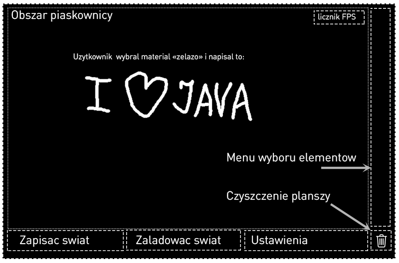
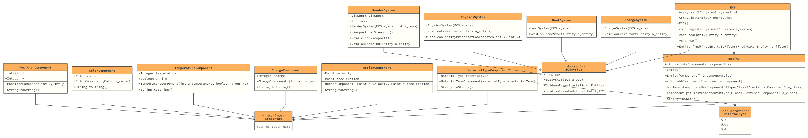

# Piaskownica 

## Opis
Tematem naszego projektu jest gra-piaskownica w języku Java, w którą można było by wybierać różne materialy i eksperementować z ich fizyką oraz różnymi oddziaływaniami mędzy tymi materialami. Każdy materal byłby przedstawiony w postaci pikselu na plansze dwójwymiarowej i miałby swoje właściwości. Użytkownik miałby przed sobą absolutną wolność wuboru materialu oraz "rysowania" tymi materialami. 

Chcelibyśmy zaimplemetować takie rzeczy jak:

* Przynajmniej trzy rodzaje materialów (proszek, ciecz, gaz)
* Symulacja grawitacji (gazy sobie latają, ciała stałe spadają na dół)
* Podstawowe zjawiska termodynamiczne (n.p. odparowywanie wody)
* Proste zjawiska elektrodynamiczne (przepływy ładunków)
* Prosty i estetyczny GUI 
* Możliwość zapisać zarówno jak odczytać swój progres z/do pliku (file-save progress)
* ~~Mikrotransakcje~~ 

## Planowany GUI 

## Diagram Klas 
(może ulec zmianie!)

